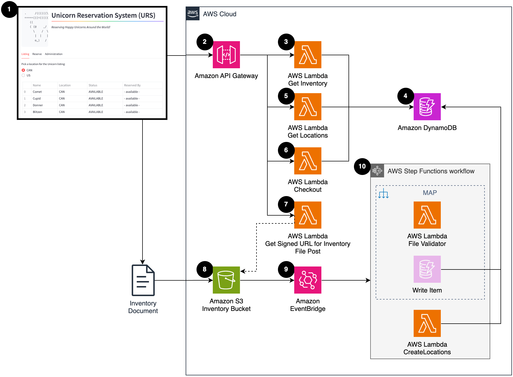

# Serverless Testing Workshop

## Introduction

The project is a companion System Under Test for the Serverless Test Workshop.  
For details and use, see the [Serverless Testing Workshop](https://catalog.us-east-1.prod.workshops.aws/workshops/0f9013f4-3960-426d-a445-dc3519b8e3d4/en-US) in Workshop Studio. 

---

## Architecture

The system under test is a Unicorn Reservation System (URS) Application has a thin front-end, which makes API calls to the back-end services.

[

* The user interacts with a (locally) hosted UI [1].
* An Amazon API Gateway  [2] serves as the host for the back-end API calls, routing requests to multiple AWS Lambda  functions based on the endpoint.
* An AWS Lambda  [3] function will query the Amazon DynamoDB  Table [4] that stores the Unicorn Inventory.
* An Amazon DynamoDB  Table [4] stores the list of Unicorns, including the Unicorn Name, Location, Reservation Status, and for whom the unicorn is reserved.
* A Lambda function [5] returns the list of potential locations for Unicorns.
* A Lambda function [6] handles the reservation of a Unicorn
* A Lambda function [7] produces a signed URL for a user to upload a CSV file.
* A user can upload an inventory CSV file to an Amazon S3  Bucket [8]. Uploading a CSV file to the S3 Bucket triggers an EventBridge event [9].
* The event [9] invokes an AWS Step Function  [10], which reads the file and runs a validation Lambda function and a DynamoDB write for the Unicorns in the CSV file. Finally, a list of Unicorn locations is compiled.