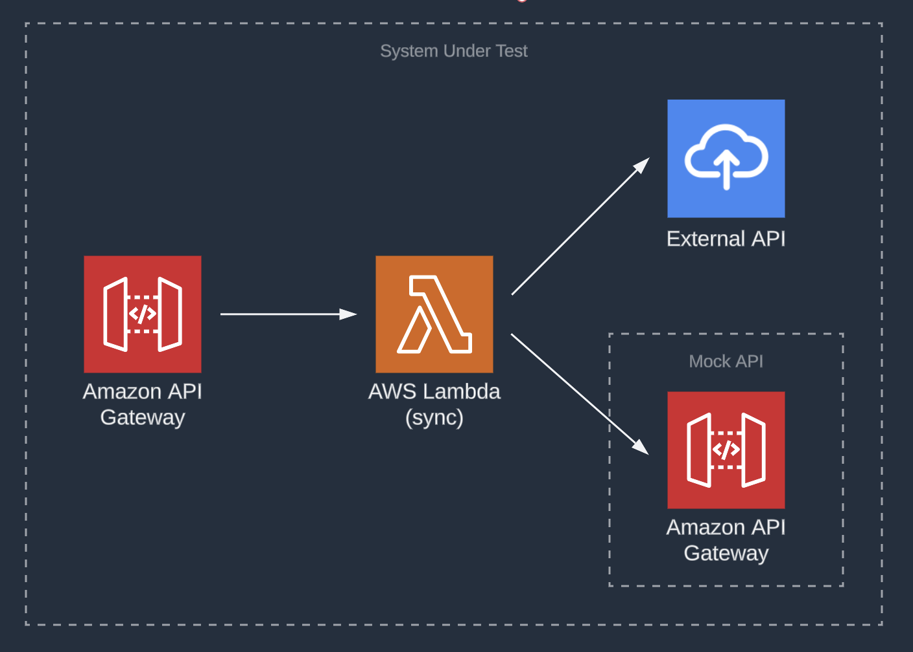

[](https://badgen.net/badge/Built%20With/TypeScript/blue9)
[](https://img.shields.io/badge/Test-Unit-blue)
[](https://img.shields.io/badge/Test-Integration-yellow)

# Typescript: Amazon Api Gateway, AWS Lambda, External API dependency

## Introduction

This project contains introductory examples of TypeScript tests written for AWS Lambda. This is a great place to start!

The project uses the [AWS Serverless Application Model](https://docs.aws.amazon.com/serverless-application-model/latest/developerguide/what-is-sam.html) (SAM) CLI for configuration, testing and deployment.

---

## Contents

- [Introduction](#introduction)
- [Contents](#contents)
- [About this Pattern](#about-this-pattern)
- [About this Example](#about-this-example)
  - [Key Files in the Project](#key-files-in-the-project)
- [Sample project description](#sample-project-description)
- [Run the Unit Test](#run-the-unit-test)
- [Run the Integration Test](#run-the-integration-test)

---

## About this Pattern

### System Under Test (SUT)

The SUT in this pattern is a synchronous API composed of Amazon API Gateway, AWS Lambda and a simple external API.



### Goal

The goal of this pattern is to test the SUT in an environment as similar to production as possible by running tests against resources deployed to the cloud but not communicating with an external API.

### Description

The SUT will be deployed to the AWS cloud. The test code will create an HTTP client that will send requests to the deployed API Gateway endpoint. The endpoint will invoke the backing services, test resource configuration, IAM permissions, authorizers, and internal business logic of the SUT. The SUT will not have any dependency on the external API, resulting in the service not being negatively impacted by the constraints or idiosyncrasies of external systems, ensuring that this system remains robust whilst under test.


## [Top](#contents)

## About this Example

This sample project allows a user to call an API endpoint with a city location to retrieve the weather and multi day forecast using an external api [https://goweather.herokuapp.com/weather](https://goweather.herokuapp.com/weather). In this example the AWS API Gateway and AWS Lambda are acting as a proxy and providing no specific business logic over the response from the weather API.

This project consists of an [API Gateway](https://aws.amazon.com/api-gateway/), a single [AWS Lambda](https://aws.amazon.com/lambda) function, and an [API Gateway](https://aws.amazon.com/api-gateway/) mock of the external dependency.

### Key Files in the Project

- [app.ts](src/app.ts) - Lambda handler code to test
- [template.yaml](template.yaml) - SAM script for deployment
- [test-handler.test.ts](src/tests/unit/test-handler.test.ts) - Unit test using mocks
- [integration-handler.test.ts](src/tests/integration/integration-handler.test.ts) - Integration tests on a live stack

## [Top](#contents)

## Run the Unit Tests

[test-handler.test.ts](src/tests/unit/test-handler.test.ts)

In the [unit test](src/tests/unit/test-handler.test.ts#L44), all calls to the external dependency are mocked.
To run the unit tests

```shell
apigw-lambda-external$ cd src
src $ npm install
src $ npm run test:unit
```

[Top](#contents)

---

## Run the Integration Tests

[integration-handler.test.ts](src/tests/integration/integration-handler.test.ts)

As this sample contains reference to an external API, to perform the integration tests without the dependency a volatile resource [API Gateway](https://aws.amazon.com/api-gateway/) is required to behave as the external API. To achieve this an additional parameter `IsVolatile` is required during the `sam deploy` step. This will instruct the cloudformation to deploy the mock api and configure the Lambda to utilise this API Gateway.

For integration tests, deploy the full stack before testing:

```shell
apigw-lambda-external$ sam build
apigw-lambda-external$ sam deploy --guided
```

The [integration tests](src/tests/integration/integration-handler.test.ts) need to be provided 1 environment variables.

1. The `API_URL` is the base URL of the API Gateway deployment stage, which should end with `/Volatile` in this case.

Set up the environment variables, replacing the `<PLACEHOLDERS>` with your values:

```shell
src $ export API_URL=<YOUR_APIGATEWAY_BASE_URL>
```

Then run the test suite.

```shell
apigw-lambda-external$ cd src
src $ npm install
src $ npm run test:integration
```

Alternatively, you can set the environment variables and run the test suite all in one command:

```shell
apigw-lambda-external$ cd src
src $ npm install
src $ API_URL=<YOUR_APIGATEWAY_BASE_URL> npm run test:integration
```

[Top](#contents)
